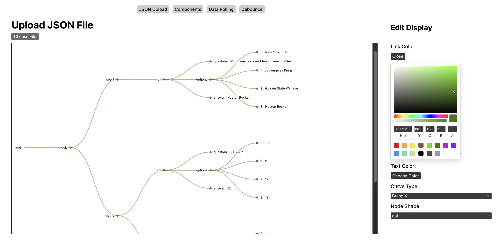

# JSON Data Visualization Tool

## Plenful / OA Spring 2024 Project

### Description

The JSON Data Visualization Tool is an easy-to-use web application that allows users to visualize any type of JSON data in a customizable, interactive tree structure. With its intuitive interface and powerful visualization capabilities, this tool provides an efficient way to explore and understand complex JSON data hierarchies.

### Features

- **Visualize Any JSON Data:** Upload any JSON file, and the tool will instantly render it as an interactive tree diagram, making it easy to navigate and explore the data structure.
- **Customizable View:** Tailor the visualization to your preferences by adjusting various display settings, such as link colors, text colors, curve types, and node shapes.
- **Responsive Design:** The tool is built with a responsive layout, ensuring a great user experience across different devices and screen sizes.
- **Interactive Nodes:** Expand or collapse individual nodes to reveal or hide nested data, providing a clear and organized view of the JSON structure.
- **Clear and Readable:** The tool presents the JSON data in a clean and readable format, making it easier to understand and analyze complex data structures.

### Tools Used

- [React](https://reactjs.org/) - A JavaScript library for building user interfaces
- [TypeScript](https://www.typescriptlang.org/) - A typed superset of JavaScript that compiles to plain JavaScript
- [D3.js](https://d3js.org/) - A JavaScript library for visualizing data using web standards
- [Observable Plot](https://observablehq.com/@observablehq/plot) - A library for creating interactive plots and visualizations
- [react-router](https://reactrouter.com/) - A library for client-side routing in React applications
- [react-color](https://react-color.gitbook.io/react-color/) - A collection of color pickers for React

### Installation

1. **Prerequisites:** Ensure you have Node.js and npm (Node Package Manager) installed on your system.

2. **Clone the Repository:**

   ```
   git clone -b graph-ui-kyle https://github.com/sv2506/Graph_UI_Mar_2024.git
   cd mosier-graph-ui
   ```

3. **Install Dependencies:**

   ```
   npm install
   ```

4. **Start the Development Server:**

   ```
   npm run dev
   ```

   This will start the development server, and the application will be available at `http://localhost:5173` in your web browser.

### Usage

1. Navigate to the application in your web browser.
2. Choose "JSON Upload" in the navigation
3. Click the "Choose File" button and select a JSON file from your local machine.
4. The JSON data will be instantly visualized as an interactive tree diagram.
5. Use the customization options to adjust the visualization according to your preferences (link colors, text colors, curve types, and node shapes).
6. Explore the JSON data by expanding or collapsing nodes to reveal or hide nested data.

### Preview



### Limitations

- The application might not be able to load and visualize extremely large JSON files due to performance constraints.
